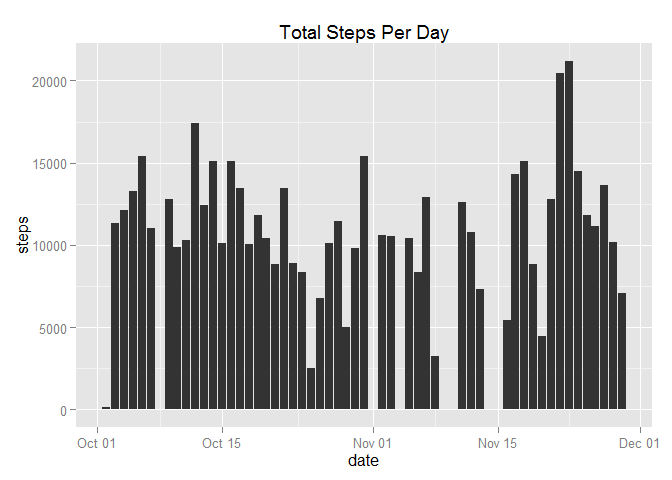
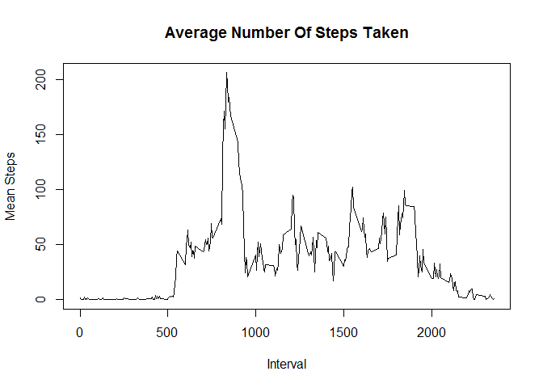
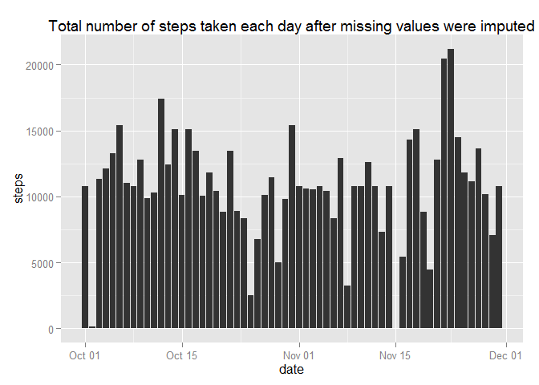
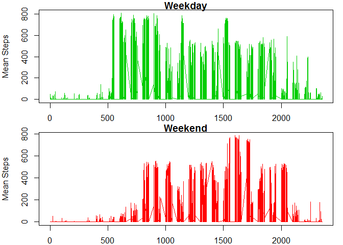

# Reproducible Research: Peer Assessment 1


## Loading and preprocessing the data

```r
library(ggplot2)
  
# Load data from csv file
activity_data <- read.csv("activity.csv")
#Strip out NAs
noNA_data <- activity_data[complete.cases(activity_data[,]),]
#convert to date
noNA_data$date <- as.Date(as.character(noNA_data$date),"%Y-%m-%d")
```


## What is mean total number of steps taken per day?

```r
agg_noNA_data <- aggregate(noNA_data$steps, by=list(date=noNA_data$date), FUN=sum)
names(agg_noNA_data)[2]<-"steps"

#plot
qplot(date,steps,data=agg_noNA_data,geom = "bar",stat="identity",main="Total Steps Per Day")
```

 

```r
#mean & median
noNA_mean_median <- aggregate(noNA_data$steps, by=list(date=noNA_data$date), FUN=mean)
names(noNA_mean_median)[2]<-"mean_steps"
noNA_median_steps <- aggregate(noNA_data$steps, by=list(date=noNA_data$date), FUN=median)
noNA_mean_median <- merge(noNA_mean_median, noNA_median_steps, by = c("date"), all.x = TRUE)
names(noNA_mean_median)[3]<-"median_steps"
#Show values
noNA_mean_median
```

```
##          date mean_steps median_steps
## 1  2012-10-02  0.4375000            0
## 2  2012-10-03 39.4166667            0
## 3  2012-10-04 42.0694444            0
## 4  2012-10-05 46.1597222            0
## 5  2012-10-06 53.5416667            0
## 6  2012-10-07 38.2465278            0
## 7  2012-10-09 44.4826389            0
## 8  2012-10-10 34.3750000            0
## 9  2012-10-11 35.7777778            0
## 10 2012-10-12 60.3541667            0
## 11 2012-10-13 43.1458333            0
## 12 2012-10-14 52.4236111            0
## 13 2012-10-15 35.2048611            0
## 14 2012-10-16 52.3750000            0
## 15 2012-10-17 46.7083333            0
## 16 2012-10-18 34.9166667            0
## 17 2012-10-19 41.0729167            0
## 18 2012-10-20 36.0937500            0
## 19 2012-10-21 30.6284722            0
## 20 2012-10-22 46.7361111            0
## 21 2012-10-23 30.9652778            0
## 22 2012-10-24 29.0104167            0
## 23 2012-10-25  8.6527778            0
## 24 2012-10-26 23.5347222            0
## 25 2012-10-27 35.1354167            0
## 26 2012-10-28 39.7847222            0
## 27 2012-10-29 17.4236111            0
## 28 2012-10-30 34.0937500            0
## 29 2012-10-31 53.5208333            0
## 30 2012-11-02 36.8055556            0
## 31 2012-11-03 36.7048611            0
## 32 2012-11-05 36.2465278            0
## 33 2012-11-06 28.9375000            0
## 34 2012-11-07 44.7326389            0
## 35 2012-11-08 11.1770833            0
## 36 2012-11-11 43.7777778            0
## 37 2012-11-12 37.3784722            0
## 38 2012-11-13 25.4722222            0
## 39 2012-11-15  0.1423611            0
## 40 2012-11-16 18.8923611            0
## 41 2012-11-17 49.7881944            0
## 42 2012-11-18 52.4652778            0
## 43 2012-11-19 30.6979167            0
## 44 2012-11-20 15.5277778            0
## 45 2012-11-21 44.3993056            0
## 46 2012-11-22 70.9270833            0
## 47 2012-11-23 73.5902778            0
## 48 2012-11-24 50.2708333            0
## 49 2012-11-25 41.0902778            0
## 50 2012-11-26 38.7569444            0
## 51 2012-11-27 47.3819444            0
## 52 2012-11-28 35.3576389            0
## 53 2012-11-29 24.4687500            0
```


## What is the average daily activity pattern?

```r
intervalAgg <- aggregate(noNA_data$steps, by=list(date=noNA_data$interval), FUN=mean)
names(intervalAgg)[1]<-"interval"
names(intervalAgg)[2]<-"steps"
ts <- ts(intervalAgg$steps,frequency=24*12)
plot(intervalAgg$interval,ts,type="l",xlab="Interval",ylab="Mean Steps",main="Average Number Of Steps Taken")
```

 

```r
maxSteps <- max(intervalAgg$steps)
maxstepinterval <- intervalAgg[which(intervalAgg$steps == maxSteps),1] 
```
The 5-minute interval that contains 206.1698113, which is the maximum number of steps, is interval 835

## Imputing missing values

My strategy is to calculate the mean for each 5 minute interval and apply that to NA values.


```r
# Load data 
all_activity_data <- activity_data

#use mean calulated in intervalAgg to replace NAs
modifiedMeans <- merge(all_activity_data, intervalAgg, by = c("interval"), all.x = TRUE)
modifiedMeans <- transform(modifiedMeans, steps = ifelse(is.na(steps.x), steps.y, steps.x), steps.x = NULL, steps.y = NULL)

#convert to date
modifiedMeans$date <- as.Date(as.character(modifiedMeans$date),"%Y-%m-%d")

#plot
qplot(date,steps,data=modifiedMeans,geom = "bar",stat="identity",main="Total number of steps taken each day after missing values were imputed")
```

 

```r
#mean & median
mod_mean <- aggregate(modifiedMeans$steps, by=list(date=modifiedMeans$date), FUN=mean)
names(mod_mean)[2]<-"mean_steps"
mod_median <- aggregate(modifiedMeans$steps, by=list(date=modifiedMeans$date), FUN=median)
names(mod_median)[2]<-"median_steps"

mod_mean_median <- aggregate(modifiedMeans$steps, by=list(date=modifiedMeans$date), FUN=mean)
names(mod_mean_median)[2]<-"mean_steps"
mod_median_steps <- aggregate(modifiedMeans$steps, by=list(date=modifiedMeans$date), FUN=median)
mod_mean_median <- merge(mod_mean_median, mod_median_steps, by = c("date"), all.x = TRUE)
names(mod_mean_median)[3]<-"median_steps"

#Show values
mod_mean_median
```

```
##          date mean_steps median_steps
## 1  2012-10-01 37.3825996     34.11321
## 2  2012-10-02  0.4375000      0.00000
## 3  2012-10-03 39.4166667      0.00000
## 4  2012-10-04 42.0694444      0.00000
## 5  2012-10-05 46.1597222      0.00000
## 6  2012-10-06 53.5416667      0.00000
## 7  2012-10-07 38.2465278      0.00000
## 8  2012-10-08 37.3825996     34.11321
## 9  2012-10-09 44.4826389      0.00000
## 10 2012-10-10 34.3750000      0.00000
## 11 2012-10-11 35.7777778      0.00000
## 12 2012-10-12 60.3541667      0.00000
## 13 2012-10-13 43.1458333      0.00000
## 14 2012-10-14 52.4236111      0.00000
## 15 2012-10-15 35.2048611      0.00000
## 16 2012-10-16 52.3750000      0.00000
## 17 2012-10-17 46.7083333      0.00000
## 18 2012-10-18 34.9166667      0.00000
## 19 2012-10-19 41.0729167      0.00000
## 20 2012-10-20 36.0937500      0.00000
## 21 2012-10-21 30.6284722      0.00000
## 22 2012-10-22 46.7361111      0.00000
## 23 2012-10-23 30.9652778      0.00000
## 24 2012-10-24 29.0104167      0.00000
## 25 2012-10-25  8.6527778      0.00000
## 26 2012-10-26 23.5347222      0.00000
## 27 2012-10-27 35.1354167      0.00000
## 28 2012-10-28 39.7847222      0.00000
## 29 2012-10-29 17.4236111      0.00000
## 30 2012-10-30 34.0937500      0.00000
## 31 2012-10-31 53.5208333      0.00000
## 32 2012-11-01 37.3825996     34.11321
## 33 2012-11-02 36.8055556      0.00000
## 34 2012-11-03 36.7048611      0.00000
## 35 2012-11-04 37.3825996     34.11321
## 36 2012-11-05 36.2465278      0.00000
## 37 2012-11-06 28.9375000      0.00000
## 38 2012-11-07 44.7326389      0.00000
## 39 2012-11-08 11.1770833      0.00000
## 40 2012-11-09 37.3825996     34.11321
## 41 2012-11-10 37.3825996     34.11321
## 42 2012-11-11 43.7777778      0.00000
## 43 2012-11-12 37.3784722      0.00000
## 44 2012-11-13 25.4722222      0.00000
## 45 2012-11-14 37.3825996     34.11321
## 46 2012-11-15  0.1423611      0.00000
## 47 2012-11-16 18.8923611      0.00000
## 48 2012-11-17 49.7881944      0.00000
## 49 2012-11-18 52.4652778      0.00000
## 50 2012-11-19 30.6979167      0.00000
## 51 2012-11-20 15.5277778      0.00000
## 52 2012-11-21 44.3993056      0.00000
## 53 2012-11-22 70.9270833      0.00000
## 54 2012-11-23 73.5902778      0.00000
## 55 2012-11-24 50.2708333      0.00000
## 56 2012-11-25 41.0902778      0.00000
## 57 2012-11-26 38.7569444      0.00000
## 58 2012-11-27 47.3819444      0.00000
## 59 2012-11-28 35.3576389      0.00000
## 60 2012-11-29 24.4687500      0.00000
## 61 2012-11-30 37.3825996     34.11321
```


## Are there differences in activity patterns between weekdays and weekends?

```r
#Work out whether date is weekday or weekend 
modifiedMeans$weekdays <- weekdays(modifiedMeans$date)
modifiedMeans <- transform(modifiedMeans, weekdays = ifelse(weekdays %in% c("Saturday","Sunday"), "weekend", "weekday"))
modifiedMeans$weekdays <- factor(modifiedMeans$weekdays)

tsWeekday <- ts(modifiedMeans[which(modifiedMeans$weekdays == "weekday"),3],frequency=24*12)
tsWeekend <- ts(modifiedMeans[which(modifiedMeans$weekdays == "weekend"),3],frequency=24*12)

par(mfrow = c(2, 1),mar = c(2,4,1,1))
plot(modifiedMeans[which(modifiedMeans$weekdays == "weekday"),1],tsWeekday,type="l",xlab="Interval",ylab="Mean Steps",main="Weekday",col=3)
par(mar = c(2,4,1,1))
plot(modifiedMeans[which(modifiedMeans$weekdays == "weekend"),1],tsWeekend,type="l",xlab="Interval",ylab="Mean Steps",main="Weekend",col=2)
```

 
